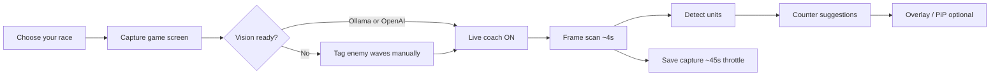
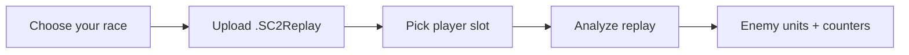
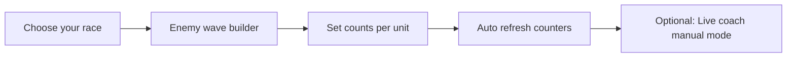

# Starcraft-DS — UI wireframes

Low-fidelity wireframes for layout and flows. The live app uses a dark SC2-themed UI (Rajdhani / Orbitron fonts, green accent).

---

## 1. Main app — desktop layout

Two-column grid: **capture & input** (left) · **suggestions** (right).

```
┌──────────────────────────────────────────────────────────────────────────────┐
│  STARCRAFT-DS                                    [ Open overlay ]           │
│  Screen capture, replay import, and overlay coach   [Protoss][Terran][Zerg] │
├────────────────────────────────────────────┬─────────────────────────────────┤
│  LEFT PANEL                                │  RIGHT PANEL                    │
│  ┌──────────────────────────────────────┐  │  ┌───────────────────────────┐  │
│  │                                      │  │  │ Counter suggestions       │  │
│  │     GAME CAPTURE PREVIEW (video)     │  │  │ ─────────────────────────  │  │
│  │     or placeholder text              │  │  │ [LIVE] badge (optional)   │  │
│  │                                      │  │  │                           │  │
│  └──────────────────────────────────────┘  │  │ Detected: [tag][tag][tag] │  │
│                                            │  │                           │  │
│  [ Capture game screen ]                   │  │ ▼ Enemy: Mutalisk         │  │
│     — or when capturing —                  │  │   • Phoenix               │  │
│  [Analyze][Live coach][PiP][Save][Stop]    │  │   • Corsair               │  │
│                                            │  │ ▼ Enemy: Roach ×3         │  │
│  ▶ Recent captures (3)              ▸      │  │   • Immortal              │  │
│    (collapsed by default)                  │  │                           │  │
│                                            │  └───────────────────────────┘  │
│  ● Vision status / live coach hint         │                                 │
│                                            │  (optional AI scene snippet)    │
│  ── Replay import ─────────────────────    │                                 │
│  [ Choose .SC2Replay ]  filename.sc2replay  │                                 │
│  [ Analyze replay ]                        │                                 │
│                                            │                                 │
│  ── Enemy waves (manual builder) ─────    │                                 │
│  [ Wave 1 ][ Wave 2 ][ Wave 3 ]            │                                 │
│  Opponent race: [P][T][Z]                  │                                 │
│  ┌ unit grid with tier labels ─────────┐   │                                 │
│  │ Tier 1  Marine        [  0 ]        │   │                                 │
│  │         Marauder      [ 12 ]        │   │                                 │
│  └─────────────────────────────────────┘   │                                 │
│  [Clear wave][Clear all][Refresh counters] │                                 │
│                                            │                                 │
│  (error message in red, if any)            │                                 │
├────────────────────────────────────────────┴─────────────────────────────────┤
│  Footer: counter data sources (Osiris, Vaughn Royko, Havrlant)               │
└──────────────────────────────────────────────────────────────────────────────┘
```

---

## 2. Capture states

### 2a. Idle (not sharing screen)

```
┌─────────────────────────────┐
│                             │
│   Share your StarCraft II   │
│   window or full screen     │
│   to begin                  │
│                             │
└─────────────────────────────┘
[ Capture game screen ]  (primary)
```

### 2b. Active capture

```
┌─────────────────────────────┐
│  << live video frame >>     │
└─────────────────────────────┘
[ Analyze now ] [ Live coach ] [ Pop out PiP ] [ Save snapshot ] [ Stop capture ]
▶ Recent captures (N)
● Live vision (ollama) — updates every few seconds.
```

---

## 3. Recent captures (expanded)

Stored in **browser IndexedDB** for 7 days; not sent to the server.

```
▾ Recent captures                    [ 12 ]
  Saved locally in your browser for 7 days. Download as JPEG anytime.

  ┌────┬──────────────────────────────────────┐
  │thumb│ Jun 1, 2:34 PM                       │
  │    │ Mutalisk, Roach, Siege Tank            │
  │    │ [ Download ]  [ Remove ]              │
  ├────┼──────────────────────────────────────┤
  │thumb│ Jun 1, 2:12 PM                       │
  │    │ Manual snapshot                       │
  │    │ [ Download ]  [ Remove ]              │
  └────┴──────────────────────────────────────┘
  [ Clear all ]
```

**Save triggers:** Analyze now · Live coach (~every 45s) · Save snapshot button.

---

## 4. Manual army builder (wave editor)

Three waves (color-coded: red / amber / cyan). Each wave has its own opponent race and unit counts.

```
Enemy waves (up to 3)
[ Wave 1 (2) ] [ Wave 2 ] [ Wave 3 (1) ]     ← active tab highlighted

Editing Wave 2 — Terran units by tech tier.
Opponent race (Wave 2):  [ Protoss ][ Terran ][ Zerg ]

┌─ grid (scrollable) ─────────────────────────┐
│ TIER 1                                      │
│   SCV                              [    ]   │
│   Marine                           [  8 ]   │
│ TIER 2                                      │
│   Marauder                         [  4 ]   │
│   Siege Tank                       [  2 ]   │
└─────────────────────────────────────────────┘

3 tagged · 14 units total    [Clear Wave 2][Clear all][Refresh counters]
```

Counters refresh automatically ~450ms after any wave change (debounced).

---

## 5. Replay import

```
── Replay import ─────────────────────────────
Upload a .SC2Replay to extract enemy units…

[ Choose .SC2Replay file ]   MyGame.SC2Replay

Map: …  |  Duration: …
Player slot: [ dropdown ]
[ Analyze replay ]
```

---

## 6. Overlay window (`/overlay.html`)

Compact always-on-top coach; syncs from main app via `localStorage` + `BroadcastChannel`.

```
┌─────────────────────────────┐
│ SC2 COACH            ● LIVE │  ← draggable header (Electron)
├─────────────────────────────┤
│  (compact SuggestionsPanel) │
│  tags + counter list        │
│  scrollable                 │
├─────────────────────────────┤
│ ☑ Always on top             │  ← Electron only
│ ☐ Click-through             │
└─────────────────────────────┘
```

---

## 7. Picture-in-Picture (browser)

Floating window while capture is active (Chrome / Edge).

```
┌──────────────────┐
│  mini video feed │
├──────────────────┤
│  live counters   │  ← scrollable suggestions
│  (compact)       │
└──────────────────┘
```

---

## 8. User flows (Mermaid)

### Live play with vision



### Replay-only (no capture)



### Manual-only (no AI vision)



---

## 9. API touchpoints (for context)

| UI action | Endpoint |
|-----------|----------|
| Health / vision status | `GET /api/health` |
| Unit catalog (builder) | `GET /api/units` |
| Analyze frame / manual | `POST /api/analyze` |
| Replay | `POST /api/replay` (multipart) |

Capture history is **client-only** (IndexedDB); no server endpoint.

---

## 10. Responsive note

The main grid is side-by-side on wide screens; narrow viewports stack panels vertically (preview above suggestions). Overlay and PiP are fixed compact widths independent of main layout.
